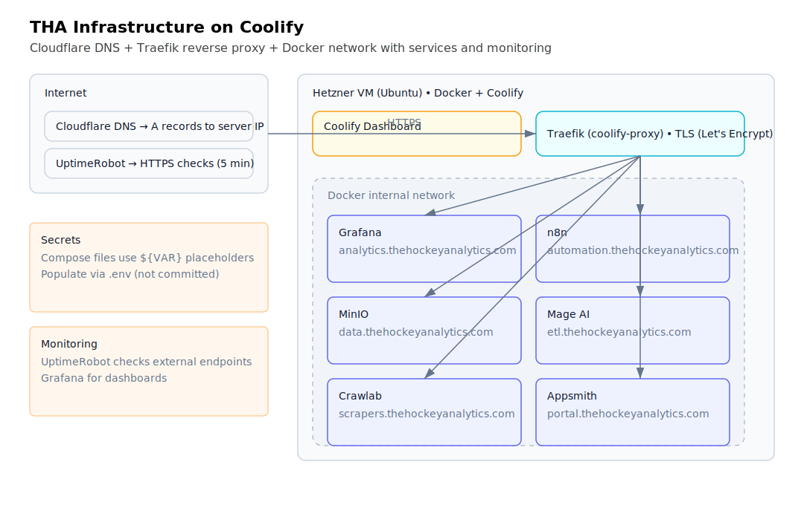

# The Unnamed Roads - Coolify Infrastructure

<div align="center">


</div>

Docker Compose configurations for The Unnamed Roads multi-project infrastructure deployed on Coolify. Hosts services for various projects including data pipelines, automation workflows, and analytics dashboards.

## Project Structure

```text
├── scripts/              # Operational automation scripts
│   ├── diagnose.sh      # External endpoint verification
│   ├── docker-cleanup.sh # Docker resource cleanup
│   ├── post-reboot-recover.sh # Recovery after server reboot
│   ├── quick-ssh.sh     # Quick health check
│   ├── quick-test.sh    # Service endpoint testing
│   └── validate-env.sh  # Environment validation
├── docs/
│   ├── guides/          # Operational documentation
│   │   ├── DISK-UPGRADE-GUIDE.md
│   │   ├── EMERGENCY-RECOVERY.md
│   │   ├── MONITORING.md
│   │   └── VSCODE-CONNECTION.md
│   ├── deprecated/      # Archived configurations
│   └── architecture-diagram.svg
├── [service]/           # Service directories (grafana, n8n, minio, etc.)
│   ├── docker-compose.yml
│   └── README.md
├── .env.example         # Environment template (copy to .env)
├── CONTRIBUTING.md
├── LICENSE
└── README.md
```

## Why This Project (Recruiter Focus)

This repository demonstrates hands-on DevOps/Infrastructure capability:

- Multi-service container orchestration with Docker Compose & Traefik reverse proxy
- Production hardening (log rotation, swap management, resource limits, decommission decisions)
- Security & compliance: secrets externalized via `.env`, no hardcoded credentials
- Operational automation: health diagnostics (`scripts/quick-ssh.sh`), endpoint verification (`scripts/diagnose.sh`), cleanup routines
- Monitoring & alerting integration (UptimeRobot + Grafana stack)
- Documentation discipline: recovery, monitoring, disk upgrade, onboarding guides

## Setup & Secrets

1. Copy `.env.example` to `.env` and set strong secrets.
2. Do NOT commit `.env`.
3. Deploy services through Coolify using sanitized `docker-compose.yml` files.
4. Rotate secrets quarterly or after contributor changes.

```bash
cp .env.example .env
edit .env   # fill CHANGEME_* values
```

Environment variables used for sensitive config are referenced in compose files like `${MINIO_ROOT_PASSWORD}`. Missing values will cause service startup errors—validate with Coolify or `docker compose config` locally first.

### Validate Environment Before Deploy

Run the helper script to ensure no `CHANGEME` placeholders remain:

```bash
./scripts/validate-env.sh
```

## Server Details

- **Platform**: Coolify on Hetzner Cloud (Ubuntu 22.04, 4GB RAM)
- **IP**: 46.62.206.47
- **DNS Provider**: Cloudflare

## Active Services

### Grafana (`analytics.thehockeyanalytics.com`)

Visualization and analytics dashboard

- Directory: `grafana/`

### N8N

Workflow automation platform

- Directory: `n8n/`

### MinIO

S3-compatible object storage

- Directory: `minio/`

### Mage AI

Data pipeline orchestration

- Directory: `mage-ai/`

### Crawlab

Web scraping framework

- Directory: `crawlab/`

### Appsmith

Low-code application platform

- Directory: `appsmith/`

## Decommissioned Services

### ClickHouse ❌

Removed due to disk space issues (profiling data filled 57GB). If data warehouse needed in future, consider:

- PostgreSQL with TimescaleDB extension
- DuckDB/MotherDuck
- Managed cloud service

## Architecture



### Network Stack

- **Traefik** (coolify-proxy): Reverse proxy handling HTTPS/SSL termination
- **Cloudflare DNS**: Manages all domain records pointing to 46.62.206.47
- **Let's Encrypt**: Automatic SSL certificate renewal via Traefik

### Service Communication

All services communicate via Docker's internal network. Traefik routes external HTTPS traffic based on domain:

- `analytics.thehockeyanalytics.com` → Grafana
- `coolify.theunnamedroads.com` → Coolify dashboard

### Data Persistence

Each service has dedicated Docker volumes mounted at `/var/lib/docker/volumes/`:

- Service data survives container restarts
- Volumes persist across redeployments
- Regular backups recommended for critical data

### Resource Limits

- **Server**: 4GB RAM, 75GB disk
- **Swap**: 4GB (prevents OOM kills)
- **Docker logs**: Limited to 10MB × 3 files per container
- **Disk usage target**: Keep below 70% to allow for spikes

## Server Configuration

### Swap

4GB swap configured to prevent OOM issues:

```bash
/swapfile none swap sw 0 0
```

### Docker Logging

Log rotation configured in `/etc/docker/daemon.json`:

```json
{
  "log-driver": "json-file",
  "log-opts": {
    "max-size": "10m",
    "max-file": "3"
  }
}
```

## Documentation Index

- **[README.md](README.md)** (this file) - Main overview and architecture
- **[VSCODE-CONNECTION.md](docs/guides/VSCODE-CONNECTION.md)** - Detailed VS Code Remote-SSH setup
- **[MONITORING.md](docs/guides/MONITORING.md)** - Health monitoring, alerts, and automated checks
- **[EMERGENCY-RECOVERY.md](docs/guides/EMERGENCY-RECOVERY.md)** - Crisis procedures when server is down
- **[DISK-UPGRADE-GUIDE.md](docs/guides/DISK-UPGRADE-GUIDE.md)** - Disk space management procedures

## Quick Access

### SSH Connection

Two convenient aliases configured in `~/.ssh/config`:

```bash
ssh tha              # Quick access
ssh coolify-tha      # Full name
```


### VS Code Remote Development

1. Install **Remote - SSH** extension
2. Connect via Command Palette: `Remote-SSH: Connect to Host...`
3. Select `tha` or `coolify-tha`
4. Open `/data/coolify` directory once connected

Alternatively, click the green Remote icon (bottom-left) → `Connect to Host...` → `tha`

### Quick Diagnostics Script

Run `./scripts/quick-ssh.sh` for instant health check:

- Server connectivity
- Disk, memory, swap status
- Docker status
- Container count

```bash
./scripts/quick-ssh.sh
```

### Docker Management via GitHub Copilot

This workspace includes Docker MCP tools for managing containers directly from VS Code:

- List containers, images, volumes
- Start/stop/restart/remove containers
- Inspect container status
- View logs

Ask Copilot: "Show me running containers" or "Restart coolify container"

## Diagnostics

Run `./scripts/diagnose.sh` to verify:

- DNS resolution for all domains
- HTTPS connectivity
- Server health
- Coolify status

## Monitoring & Alerts

UptimeRobot monitoring has been restored (fixat) and now actively checks key external endpoints every 5 minutes:
 
- `analytics.thehockeyanalytics.com`
- `coolify.theunnamedroads.com`

Alerting destinations (email/Slack) are re-confirmed and functional as of Nov 2025. If adding new public services, remember to:
 
 1. Create a new monitor in UptimeRobot (HTTP(s) type)
 2. Set interval to 5 minutes (or tighter for critical services)
 3. Tag monitor with service name
 4. Verify alert contacts include primary on-call

For internal-only services, prefer local health checks or Coolify service status rather than external uptime monitors.

## Emergency Recovery

See `docs/guides/EMERGENCY-RECOVERY.md` for detailed recovery procedures if server becomes unresponsive.

## Deployment

### Initial Service Deployment

1. **Access Coolify Dashboard**
   - Navigate to <https://coolify.theunnamedroads.com>
   - Login with credentials

2. **Create New Service**
   - Click "+ New Resource" → "Service"
   - Choose "Docker Compose"

3. **Upload Configuration**
   - Copy content from service's `docker-compose.yml`
   - Paste into Coolify's compose editor
   - Configure environment variables if needed

4. **Configure Domain** (if service needs external access)
   - Add domain in service settings
   - Ensure DNS A record points to 46.62.206.47
   - Traefik will handle SSL automatically

5. **Deploy**
   - Click "Deploy"
   - Monitor logs for successful startup

### Service Updates

**Update via Coolify UI**:

1. Navigate to service in Coolify
2. Click "Edit Compose"
3. Make changes
4. Click "Deploy" (rolling restart)

**Update via SSH** (for quick fixes):

```bash
ssh tha
cd /data/coolify/services/<service-id>
nano docker-compose.yml
docker compose up -d
```

### Service Directory Structure

Each service directory contains:

- `docker-compose.yml` - Service configuration
- `README.md` - Service-specific notes and setup instructions

### Best Practices

1. **Always test locally first** before deploying to production
2. **Keep backups** of working configurations
3. **Document environment variables** in service README
4. **Use specific image tags** (avoid `:latest` for stability)
5. **Set resource limits** in compose files to prevent OOM
6. **Enable health checks** for critical services

### Adding New Services

**Checklist**:

- [ ] Create service directory with compose file
- [ ] Add service-specific README
- [ ] Configure persistent volumes for data
- [ ] Set up Traefik labels if external access needed
- [ ] Add DNS record in Cloudflare (if applicable)
- [ ] Test deployment in Coolify
- [ ] Add service to main README
- [ ] Update `scripts/diagnose.sh` if service has external endpoint

## Troubleshooting

### Server Not Responding

**Symptoms**: SSH timeout, HTTPS endpoints unreachable

**Quick checks**:

```bash
ping 46.62.206.47        # Network reachable?
./scripts/quick-ssh.sh   # Automated diagnostics
ssh -vvv tha             # Verbose SSH debug
```

**If ping works but SSH fails**:

1. Server likely overloaded (OOM, disk full)
2. Access Hetzner Cloud Console
3. Use VNC/KVM console for direct access
4. Check: `df -h`, `free -m`, `dmesg | tail`
5. See `docs/guides/EMERGENCY-RECOVERY.md` for detailed recovery

### Service Down

**Check container status**:

```bash
ssh tha 'docker ps -a'                    # All containers
ssh tha 'docker logs <container-name>'    # View logs
```

**Restart specific service**:

```bash
ssh tha 'cd /data/coolify/services/<service-id> && docker compose restart'
```

**Restart all Coolify services**:

```bash
ssh tha 'cd /data/coolify/source && docker compose restart'
```

### Disk Full

**Check what's using space**:

```bash
ssh tha 'du -xhd1 /var/lib/docker | sort -h | tail'
ssh tha 'docker system df -v'
```

**Clean up Docker**:

```bash
./scripts/docker-cleanup.sh               # From local machine
# Or manually:
ssh tha 'docker system prune -af --volumes'  # ⚠️ Removes unused volumes
```

**Emergency: Remove large volumes**:

```bash
ssh tha 'docker volume ls'                # List all volumes
ssh tha 'docker volume rm <volume-name>'  # Remove specific volume
```

### DNS/SSL Issues

**Verify DNS propagation**:

```bash
nslookup analytics.thehockeyanalytics.com
dig +short analytics.thehockeyanalytics.com
```

**Check SSL certificates**:

```bash
ssh tha 'docker logs coolify-proxy | grep -i cert'
```

**Force certificate renewal**:

```bash
ssh tha 'docker compose -f /data/coolify/proxy/docker-compose.yml restart'
```

### Docker Daemon Issues

**Check Docker status**:

```bash
ssh tha 'systemctl status docker'
```

**Restart Docker** (⚠️ stops all containers temporarily):

```bash
ssh tha 'systemctl restart docker'
```

**View Docker logs**:

```bash
ssh tha 'journalctl -u docker --no-pager | tail -100'
```

## Maintenance

### Daily Checks

```bash
./scripts/quick-ssh.sh   # Quick health snapshot
./scripts/diagnose.sh    # External endpoint verification
```

### Weekly Maintenance

```bash
# Check disk space
ssh tha 'df -h'

# Check Docker resource usage
ssh tha 'docker system df'

# Review container health
ssh tha 'docker ps --format "table {{.Names}}\t{{.Status}}"'
```

### Monthly Maintenance

```bash
# Clean unused Docker resources
./scripts/docker-cleanup.sh

# Update system packages
ssh tha 'apt update && apt upgrade -y'

# Restart services for updates
ssh tha 'cd /data/coolify/source && docker compose restart'
```

### Backup Strategy

**Critical volumes to backup**:

- `/var/lib/docker/volumes/*_grafana-data`
- `/var/lib/docker/volumes/*_n8n-data`
- `/var/lib/docker/volumes/*_postgres-data`
- `/var/lib/docker/volumes/coolify-db`

**Backup command** (run from local machine):

```bash
# Backup Grafana data
ssh tha 'tar czf /tmp/grafana-backup-$(date +%F).tgz /var/lib/docker/volumes/*_grafana-data'
scp tha:/tmp/grafana-backup-*.tgz ./backups/

# Clean up remote backup
ssh tha 'rm /tmp/grafana-backup-*.tgz'
```

**Automated backup script** (optional):

```bash
# Create backups/ directory
mkdir -p backups

# Add to crontab for weekly backups
0 2 * * 0 /path/to/backup-script.sh
```
