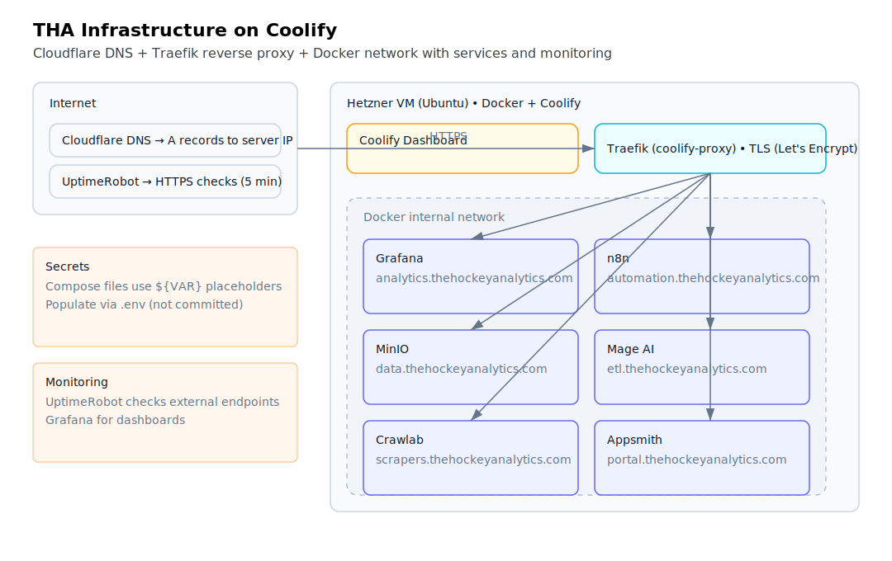

# The Unnamed Roads - Coolify Infrastructure

<div align="center">


</div>

Production-ready multi-service infrastructure showcasing DevOps best practices. Self-hosted on Hetzner Cloud with automated SSL, monitoring, and comprehensive operational tooling.

> **🔄 Uppdatera servern?** 
> - **Automatiserad:** [AUTO-UPGRADE.md](AUTO-UPGRADE.md) - Komplett automatiserad process (rekommenderat)
> - **Snabbguide:** [UPDATE.md](UPDATE.md) - 2 kommandon
> - **Komplett process:** [UPGRADE.md](UPGRADE.md) - Systematisk med versionkontroll

**Key Technical Highlights:**

- 🚀 Zero-downtime deployments via Coolify
- 🔒 Security-first: externalized secrets, automated SSL/TLS
- 📊 Full observability: Grafana dashboards + UptimeRobot monitoring
- 🛠️ Production hardening: log rotation, resource limits, swap management
- 📝 Infrastructure as Code: reproducible via Docker Compose
- 🔄 Automated operations: health checks, cleanup, recovery scripts

## Project Structure

```text
├── scripts/              # Operational automation scripts
│   ├── auto-upgrade-all.sh # Complete automated upgrade process
│   ├── sync-coolify-resources.sh # Sync Coolify resources & generate docs (filesystem)
│   ├── sync-coolify-api.sh # Sync Coolify resources via API
│   ├── list-coolify-project.sh # List all resources in a Coolify project
│   ├── generate-service-docs.sh # Generate UPGRADE.md for services
│   ├── generate-service-readme.sh # Generate README.md for services
│   ├── update-services-doc.sh # Update SERVICES.md with active services
│   ├── upgrade-check.sh # Check what needs updating per official docs
│   ├── docker-cleanup.sh # Docker resource cleanup
│   ├── server-health.sh # Omfattande serverhälsokontroll (disk, minne, CPU, Docker, containers)
│   ├── quick-ssh.sh     # Quick health check
│   ├── quick-test.sh    # Service endpoint testing
│   ├── setup-ssh.sh     # SSH connection setup wizard
│   ├── update-server.sh # Automated server updates
│   ├── verify-all.sh    # Complete verification (server, Coolify, endpoints)
│   ├── list-coolify-resources.sh # List all Coolify services and check updates
│   ├── restart-coolify.sh # Restart Coolify and all services
│   ├── fix-coolify-platform.sh # Complete fix of Coolify platform after Ubuntu update
│   ├── configure-coolify-domain.sh # Instructions to configure Coolify domain in dashboard
│   ├── fix-coolify-dashboard.sh # Fix Coolify dashboard routing (when services work but dashboard doesn't)
│   ├── fix-all-routing.sh # Complete fix of all routing problems (network, labels, API)
│   ├── fix-routing.sh    # Fix routing problems (404, not available) - IP, DNS, Traefik
│   ├── verify-and-fix-versions.sh # Verify and fix versions per Coolify official docs
│   ├── upgrade-traefik.sh # Upgrade Traefik to v3.6.1 (Coolify's recommendation)
│   ├── fix-traefik-downgrade.sh # Restore Traefik to working version after failed update
│   ├── diagnose-404.sh    # Systematic diagnosis of 404 errors
│   ├── fix-services.sh  # Fix services not available after server update
│   ├── fix-404.sh       # Fix 404 errors when services run but not accessible
│   └── validate-env.sh  # Environment validation
├── archive/             # Inaktiva services och resurser
│   ├── services/       # Inaktiva services (grafana, mage-ai, crawlab, appsmith, clickhouse)
│   ├── scripts/        # Inaktiva scripts
│   ├── docs/           # Deprecated dokumentation
│   ├── README.md       # Arkiv-dokumentation
│   └── CHANGELOG.md    # Ändringslogg
├── docs/
│   ├── guides/          # Operational documentation
│   │   ├── DISK-UPGRADE-GUIDE.md
│   │   ├── EMERGENCY-RECOVERY.md
│   │   ├── MONITORING.md
│   │   ├── SERVER-UPDATE-GUIDE.md
│   │   └── VSCODE-CONNECTION.md
│   └── architecture-diagram.svg
├── n8n/                 # N8N workflow automation
│   ├── docker-compose.yml
│   ├── UPGRADE.md      # Uppdateringsguide
│   └── README.md
├── minio/               # MinIO S3-compatible storage
│   ├── docker-compose.yml
│   ├── UPGRADE.md      # Uppdateringsguide
│   └── README.md
├── .env.example         # Environment template (copy to .env)
├── AUTO-UPGRADE.md      # Automatiserad uppgraderingsprocess
├── UPDATE.md            # Snabbguide för serveruppdatering
├── UPGRADE.md           # Komplett uppgraderingsprocess
├── VERIFY.md            # Verifieringsguide
├── SERVICES.md          # Service-översikt (auto-genererad)
├── TROUBLESHOOTING.md   # Felsökningsguide
├── CONTRIBUTING.md
├── LICENSE
└── README.md
```

## Why This Project (Recruiter Focus)

This repository demonstrates **production-grade DevOps engineering** and infrastructure management:

### Technical Capabilities Demonstrated

**Container Orchestration & Networking**

- Multi-service Docker Compose architecture with 6+ production services
- Traefik reverse proxy with automatic SSL/TLS via Let's Encrypt
- Internal Docker networking with external routing via domain-based rules
- Zero-downtime deployments through Coolify orchestration

**Security & Best Practices**

- Secrets management: zero hardcoded credentials, environment-based configuration
- Automated validation scripts prevent accidental secret exposure
- SSL/TLS automation with auto-renewal
- Production security hardening applied throughout

**Operational Excellence**

- Custom diagnostic tooling: health checks, endpoint verification, cleanup automation
- Monitoring & alerting: UptimeRobot + Grafana observability stack
- Disaster recovery: documented procedures with automated recovery scripts
- Proactive maintenance: log rotation (10MB×3), swap management (4GB), resource limits

**Infrastructure as Code & Documentation**

- Fully reproducible infrastructure via Docker Compose
- Comprehensive documentation: architecture diagrams, runbooks, troubleshooting guides
- Real-world problem-solving: decommissioned ClickHouse after 57GB disk space crisis
- Contributing guidelines and validation tooling for team collaboration

## Setup & Secrets

1. Copy `.env.example` to `.env` and set strong secrets.
2. Do NOT commit `.env`.
3. Deploy services through Coolify using sanitized `docker-compose.yml` files.
4. Rotate secrets quarterly or after contributor changes.

```bash
cp .env.example .env
edit .env   # fill CHANGEME_* values
```

Environment variables used for sensitive config are referenced in compose files like `${MINIO_ROOT_PASSWORD}`. Missing values will cause service startup errors—validate with Coolify or `docker compose config` locally first.

### Validate Environment Before Deploy

Run the helper script to ensure no `CHANGEME` placeholders remain:

```bash
./scripts/validate-env.sh
```

## Technologies & Skills

**Infrastructure & Platform**

- Docker & Docker Compose (multi-service orchestration)
- Coolify (self-hosted PaaS)
- Hetzner Cloud (Ubuntu 22.04 VPS)
- Traefik (reverse proxy & load balancer)
- Let's Encrypt (SSL/TLS automation)

**Networking & DNS**

- Cloudflare DNS management
- HTTPS/SSL certificate automation
- Domain-based routing and traffic management

**Monitoring & Observability**

- UptimeRobot (external monitoring & alerting)
- Custom health check automation

**Development Tools**

- VS Code Remote Development
- Git version control
- Bash scripting for automation

**Data & Automation**

- MinIO (S3-compatible object storage)
- PostgreSQL databases
- N8N (workflow automation)

## Server Details

- **Platform**: Coolify on Hetzner Cloud (Ubuntu 22.04, 4GB RAM, 75GB disk)
- **IP**: 46.62.206.47
- **DNS Provider**: Cloudflare
- **Deployment**: Infrastructure as Code via Docker Compose
- **Uptime**: Monitored 24/7 with automated alerting

## Active Services

### N8N (`automation.thehockeyanalytics.com`)

Workflow automation platform

- **Directory:** `n8n/`
- **Uppdateringsguide:** [n8n/UPGRADE.md](n8n/UPGRADE.md)
- **Docker Hub:** https://hub.docker.com/r/n8nio/n8n/tags

### MinIO (`data.thehockeyanalytics.com`)

S3-compatible object storage

- **Directory:** `minio/`
- **Uppdateringsguide:** [minio/UPGRADE.md](minio/UPGRADE.md)
- **Quay.io:** https://quay.io/repository/minio/minio?tab=tags

## Decommissioned Services

Följande services är inaktiva och arkiverade i `archive/services/`:

- **Grafana** - Visualization and analytics dashboard (arkiverad)
- **Mage AI** - Data pipeline orchestration (arkiverad)
- **Crawlab** - Web scraping framework (arkiverad)
- **Appsmith** - Low-code application platform (arkiverad)
- **ClickHouse** ❌ - Removed due to disk space issues (profiling data filled 57GB)

**Alternativ för data warehouse:**
- PostgreSQL with TimescaleDB extension
- DuckDB/MotherDuck
- Managed cloud service

## Architecture



### Network Stack

- **Traefik** (coolify-proxy): Reverse proxy handling HTTPS/SSL termination
- **Cloudflare DNS**: Manages all domain records pointing to 46.62.206.47
- **Let's Encrypt**: Automatic SSL certificate renewal via Traefik

### Service Communication

All services communicate via Docker's internal network. Traefik routes external HTTPS traffic based on domain:

- `analytics.thehockeyanalytics.com` → Grafana
- `coolify.theunnamedroads.com` → Coolify dashboard

### Data Persistence

Each service has dedicated Docker volumes mounted at `/var/lib/docker/volumes/`:

- Service data survives container restarts
- Volumes persist across redeployments
- Regular backups recommended for critical data

### Resource Limits

- **Server**: 4GB RAM, 75GB disk
- **Swap**: 4GB (prevents OOM kills)
- **Docker logs**: Limited to 10MB × 3 files per container
- **Disk usage target**: Keep below 70% to allow for spikes

## Server Configuration

### Swap

4GB swap configured to prevent OOM issues:

```bash
/swapfile none swap sw 0 0
```

### Docker Logging

Log rotation configured in `/etc/docker/daemon.json`:

```json
{
  "log-driver": "json-file",
  "log-opts": {
    "max-size": "10m",
    "max-file": "3"
  }
}
```

## Documentation Index

### Quick References
- **[UPDATE.md](UPDATE.md)** ⭐ - **Serveruppdatering (2 kommandon!)**
- **[VERIFY.md](VERIFY.md)** ⭐ - **Verifiera allt (1 kommando!)**
- **[SERVICES.md](SERVICES.md)** ⭐ - **Lista & uppdatera services (1 kommando!)**
- **[TROUBLESHOOTING.md](TROUBLESHOOTING.md)** ⭐ - **Fix services som inte fungerar (1 kommando!)**

### Detailed Guides
- **[README.md](README.md)** (this file) - Main overview and architecture
- **[VSCODE-CONNECTION.md](docs/guides/VSCODE-CONNECTION.md)** - Detailed VS Code Remote-SSH setup
- **[SERVER-UPDATE-GUIDE.md](docs/guides/SERVER-UPDATE-GUIDE.md)** - Detailed server update and SSH setup guide
- **[MONITORING.md](docs/guides/MONITORING.md)** - Health monitoring, alerts, and automated checks
- **[EMERGENCY-RECOVERY.md](docs/guides/EMERGENCY-RECOVERY.md)** - Crisis procedures when server is down
- **[DISK-UPGRADE-GUIDE.md](docs/guides/DISK-UPGRADE-GUIDE.md)** - Disk space management procedures

## Quick Access

### 🔄 Serveruppdatering

**Snabbaste sättet:**
```bash
cd ~/Documents/dev/tur-coolify-setup
./scripts/update-server.sh
```

Se [UPDATE.md](UPDATE.md) för detaljer.

### SSH Connection

**First time setup:**
```bash
./scripts/setup-ssh.sh  # Interactive SSH setup wizard
```

**After setup, two convenient aliases available:**

```bash
ssh tha              # Quick access
ssh coolify-tha      # Full name
```


### VS Code Remote Development

1. Install **Remote - SSH** extension
2. Connect via Command Palette: `Remote-SSH: Connect to Host...`
3. Select `tha` or `coolify-tha`
4. Open `/data/coolify` directory once connected

Alternatively, click the green Remote icon (bottom-left) → `Connect to Host...` → `tha`

### Quick Diagnostics Scripts

**Serverhälsa (rekommenderat):**
```bash
./scripts/server-health.sh    # Omfattande serverstatus: disk, minne, CPU, Docker, containers
```

**Snabb status:**
```bash
./scripts/quick-ssh.sh    # Snabb serverstatus
```

**Komplett verifiering:**
```bash
./scripts/verify-all.sh   # Verifierar allt: server, Coolify, endpoints, systemhälsa
```

**Externa endpoints:**
```bash
./scripts/diagnose.sh     # DNS och HTTPS-tester
```

### Docker Management via GitHub Copilot

This workspace includes Docker MCP tools for managing containers directly from VS Code:

- List containers, images, volumes
- Start/stop/restart/remove containers
- Inspect container status
- View logs

Ask Copilot: "Show me running containers" or "Restart coolify container"

## Diagnostics

Run `./scripts/diagnose.sh` to verify:

- DNS resolution for all domains
- HTTPS connectivity
- Server health
- Coolify status

## Monitoring & Alerts

UptimeRobot monitoring has been restored (fixat) and now actively checks key external endpoints every 5 minutes:
 
- `analytics.thehockeyanalytics.com`
- `coolify.theunnamedroads.com`

Alerting destinations (email/Slack) are re-confirmed and functional as of Nov 2025. If adding new public services, remember to:
 
 1. Create a new monitor in UptimeRobot (HTTP(s) type)
 2. Set interval to 5 minutes (or tighter for critical services)
 3. Tag monitor with service name
 4. Verify alert contacts include primary on-call

For internal-only services, prefer local health checks or Coolify service status rather than external uptime monitors.

## Emergency Recovery

See `docs/guides/EMERGENCY-RECOVERY.md` for detailed recovery procedures if server becomes unresponsive.

## Deployment

### Initial Service Deployment

1. **Access Coolify Dashboard**
   - Navigate to <https://coolify.theunnamedroads.com>
   - Login with credentials

2. **Create New Service**
   - Click "+ New Resource" → "Service"
   - Choose "Docker Compose"

3. **Upload Configuration**
   - Copy content from service's `docker-compose.yml`
   - Paste into Coolify's compose editor
   - Configure environment variables if needed

4. **Configure Domain** (if service needs external access)
   - Add domain in service settings
   - Ensure DNS A record points to 46.62.206.47
   - Traefik will handle SSL automatically

5. **Deploy**
   - Click "Deploy"
   - Monitor logs for successful startup

### Service Updates

**Update via Coolify UI**:

1. Navigate to service in Coolify
2. Click "Edit Compose"
3. Make changes
4. Click "Deploy" (rolling restart)

**Update via SSH** (for quick fixes):

```bash
ssh tha
cd /data/coolify/services/<service-id>
nano docker-compose.yml
docker compose up -d
```

### Service Directory Structure

Each service directory contains:

- `docker-compose.yml` - Service configuration
- `README.md` - Service-specific notes and setup instructions

### Best Practices

1. **Always test locally first** before deploying to production
2. **Keep backups** of working configurations
3. **Document environment variables** in service README
4. **Use specific image tags** (avoid `:latest` for stability)
5. **Set resource limits** in compose files to prevent OOM
6. **Enable health checks** for critical services

### Adding New Services

**Checklist**:

- [ ] Create service directory with compose file
- [ ] Add service-specific README
- [ ] Configure persistent volumes for data
- [ ] Set up Traefik labels if external access needed
- [ ] Add DNS record in Cloudflare (if applicable)
- [ ] Test deployment in Coolify
- [ ] Add service to main README
- [ ] Update `scripts/diagnose.sh` if service has external endpoint

## Troubleshooting

### Server Not Responding

**Symptoms**: SSH timeout, HTTPS endpoints unreachable

**Quick checks**:

```bash
ping 46.62.206.47        # Network reachable?
./scripts/quick-ssh.sh   # Automated diagnostics
ssh -vvv tha             # Verbose SSH debug
```

**If ping works but SSH fails**:

1. Server likely overloaded (OOM, disk full)
2. Access Hetzner Cloud Console
3. Use VNC/KVM console for direct access
4. Check: `df -h`, `free -m`, `dmesg | tail`
5. See `docs/guides/EMERGENCY-RECOVERY.md` for detailed recovery

### Service Down

**Check container status**:

```bash
ssh tha 'docker ps -a'                    # All containers
ssh tha 'docker logs <container-name>'    # View logs
```

**Restart specific service**:

```bash
ssh tha 'cd /data/coolify/services/<service-id> && docker compose restart'
```

**Restart all Coolify services**:

```bash
ssh tha 'cd /data/coolify/source && docker compose restart'
```

### Disk Full

**Check what's using space**:

```bash
ssh tha 'du -xhd1 /var/lib/docker | sort -h | tail'
ssh tha 'docker system df -v'
```

**Clean up Docker**:

```bash
./scripts/docker-cleanup.sh               # From local machine
# Or manually:
ssh tha 'docker system prune -af --volumes'  # ⚠️ Removes unused volumes
```

**Emergency: Remove large volumes**:

```bash
ssh tha 'docker volume ls'                # List all volumes
ssh tha 'docker volume rm <volume-name>'  # Remove specific volume
```

### DNS/SSL Issues

**Verify DNS propagation**:

```bash
nslookup analytics.thehockeyanalytics.com
dig +short analytics.thehockeyanalytics.com
```

**Check SSL certificates**:

```bash
ssh tha 'docker logs coolify-proxy | grep -i cert'
```

**Force certificate renewal**:

```bash
ssh tha 'docker compose -f /data/coolify/proxy/docker-compose.yml restart'
```

### Docker Daemon Issues

**Check Docker status**:

```bash
ssh tha 'systemctl status docker'
```

**Restart Docker** (⚠️ stops all containers temporarily):

```bash
ssh tha 'systemctl restart docker'
```

**View Docker logs**:

```bash
ssh tha 'journalctl -u docker --no-pager | tail -100'
```

## Maintenance

### Daily Checks

```bash
./scripts/quick-ssh.sh   # Quick health snapshot
./scripts/diagnose.sh    # External endpoint verification
```

### Weekly Maintenance

```bash
# Check disk space
ssh tha 'df -h'

# Check Docker resource usage
ssh tha 'docker system df'

# Review container health
ssh tha 'docker ps --format "table {{.Names}}\t{{.Status}}"'
```

### Monthly Maintenance

```bash
# Update server (see UPDATE.md for quick guide)
./scripts/update-server.sh

# Or manually:
# Clean unused Docker resources
./scripts/docker-cleanup.sh

# Update system packages
ssh tha 'apt update && apt upgrade -y'

# Restart services for updates
ssh tha 'cd /data/coolify/source && docker compose restart'
```

### Backup Strategy

**Critical volumes to backup**:

- `/var/lib/docker/volumes/*_grafana-data`
- `/var/lib/docker/volumes/*_n8n-data`
- `/var/lib/docker/volumes/*_postgres-data`
- `/var/lib/docker/volumes/coolify-db`

**Backup command** (run from local machine):

```bash
# Backup Grafana data
ssh tha 'tar czf /tmp/grafana-backup-$(date +%F).tgz /var/lib/docker/volumes/*_grafana-data'
scp tha:/tmp/grafana-backup-*.tgz ./backups/

# Clean up remote backup
ssh tha 'rm /tmp/grafana-backup-*.tgz'
```

**Automated backup script** (optional):

```bash
# Create backups/ directory
mkdir -p backups

# Add to crontab for weekly backups
0 2 * * 0 /path/to/backup-script.sh
```
