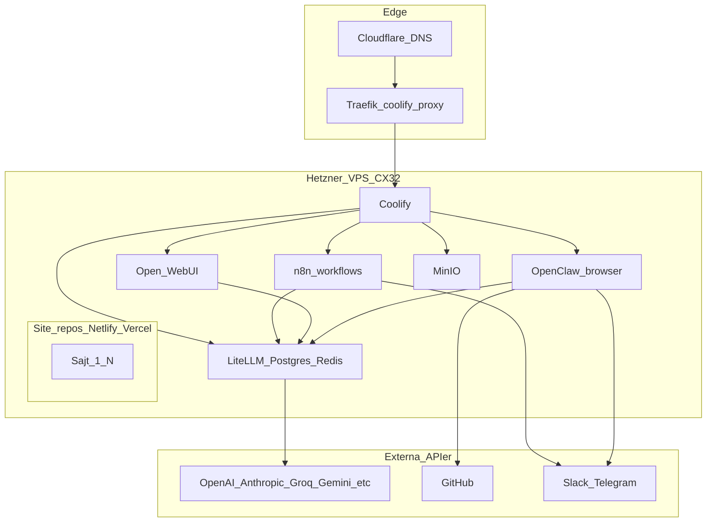
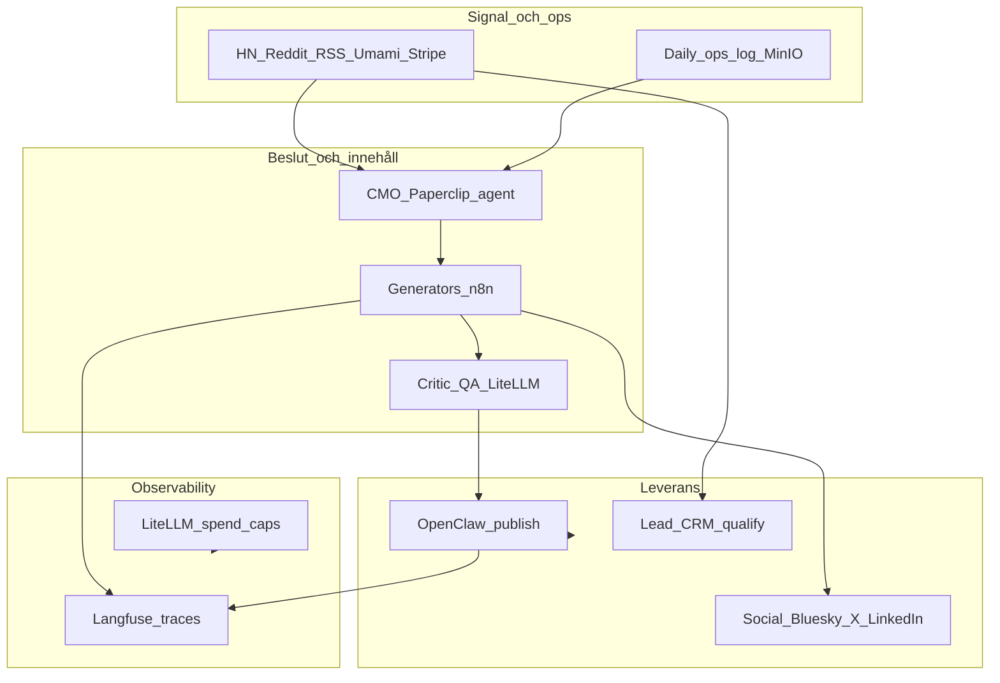

# Autonomi-audit — The Unnamed Roads (TUR)

**Datum:** 2026-04-20  
**Syfte:** Nuläge, gap mot best-in-class 2026 för ett enmans-AI venture studio, och prioriterad roadmap för autonomi inom sälj, utveckling, marknadsföring och administration.

**Relaterade källor i repot:** [`README.md`](../../README.md), [`SERVICES.md`](../../SERVICES.md), [`litellm/docker-compose.yml`](../../litellm/docker-compose.yml), [`openclaw/docker-compose.yml`](../../openclaw/docker-compose.yml), [`open-webui/docker-compose.yml`](../../open-webui/docker-compose.yml), [`docs/brand/CMO-SYSTEM-DESIGN.md`](../brand/CMO-SYSTEM-DESIGN.md), [`openclaw/OPENCLAW-OVERBLICK.md`](../../openclaw/OPENCLAW-OVERBLICK.md), [`docs/guides/CLAUDE-CLI-AUTONOMOUS-MODE.md`](../guides/CLAUDE-CLI-AUTONOMOUS-MODE.md).

**Versionskontroll (GitHub API, 2026-04-19–20):** Använd som referens vid pinning — verifiera alltid mot GHCR/Docker Hub innan deploy.

| Komponent | Senaste release (API) | Kommentar |
| --- | --- | --- |
| Open WebUI | [v0.8.12](https://github.com/open-webui/open-webui/releases/tag/v0.8.12) | Pinna `ghcr.io/open-webui/open-webui:v0.8.12` (ej `:main`) |
| LiteLLM (OSS) | [v1.83.7-stable](https://github.com/BerriAI/litellm/releases/tag/v1.83.7-stable) | Cosign-signerade images; `litellm-database`-taggar på [GHCR](https://github.com/BerriAI/litellm/pkgs/container/litellm-database) ska matchas mot samma release |
| n8n | `stable` → [2.16.1](https://github.com/n8n-io/n8n/releases) (2026-04-15) | Pinna `n8nio/n8n:2.16.1` eller `stable` med dokumenterad bytepolicy |
| Coolify | [v4.0.0-beta.473](https://github.com/coollabsio/coolify/releases/tag/v4.0.0-beta.473) (2026-04-13) | Följ Coolify upgrade-flöde i dashboard |

---

## 1. Executive summary

Du kör redan en **ovanligt mogen** self-hosted stack (Hetzner, Coolify, n8n, LiteLLM, OpenClaw, Open WebUI, MinIO, Umami) med 40+ workflows och tydliga operativa scripts (`scripts/coolify-update.sh`, `scripts/auto-upgrade-all.sh`, SEO-agent i OpenClaw). Det som skiljer dig från “full autonomi” för ett AI venture studio är inte avsaknad av verktyg utan **stängda loopar**: CMO/Paperclip-lagret är designat men inte fullt implementerat; sälj- och dev-autonomi saknar nästan helt automation; infrastrukturen saknar reproducerbar pinning, hårda resursgränser och automatiserad backup. Nästa steg är att prioritera **P0** (säkerhet/reproducerbarhet/kostnadstak) och **P1** (observability + CMO-loop), sedan P2 (sälj-agent, Renovate, social/MCP).

---

## 2. Arkitektur — nuläge och målbild

### 2.1 Nuläge (förenklat)

### 2.2 Målbild — autonom studio (en anställd + agenter)

---

## 3. Infrastruktur-audit

### 3.1 Nuläge

- **Server:** Hetzner CX32 (4 GB RAM, ~75 GB disk) — dokumenterat i [`README.md`](../../README.md); swap 4 GB och log-rotation konfigurerad.
- **Orkestrering:** Coolify + Docker Compose per tjänst; Traefik som reverse proxy.
- **Compose-filer:** T.ex. [`litellm/docker-compose.yml`](../../litellm/docker-compose.yml) med `--num_workers 1` (medveten åtgärd mot Postgres “too many clients” och minnesbrist).
- **Scripts:** `scripts/auto-upgrade-all.sh`, `scripts/update-server.sh`, `scripts/server-health.sh`, `scripts/coolify-update.sh`.

### 3.2 Gap

| Gap | Risk |
| --- | --- |
| **4 GB RAM** | Fler parallella agenter/workers → OOM eller att du måste hålla LiteLLM på 1 worker ([`CPU-LOAD-INVESTIGATION.md`](../guides/CPU-LOAD-INVESTIGATION.md)). |
| **Ubuntu 22.04** | Standard support till april 2027 — planera migration till 24.04 LTS innan press. |
| **Floating image tags** | `open-webui:main`, `litellm-database:main-stable`, `n8nio/n8n:latest`, `openclaw-browser:latest` → oförutsägbara deploys. |
| **Inga CPU/minne-gränser** | En container (historiskt LiteLLM ~271 % CPU) kan ta hela VPS:en ([`CPU-LOAD-INVESTIGATION.md`](../guides/CPU-LOAD-INVESTIGATION.md)). |
| **Backups** | README visar manuell `tar`; ingen krypterad, verifierad, schemalagd backup till MinIO/S3/Storage Box. |
| **[`SERVICES.md`](../../SERVICES.md)** | Dubbel-generering och sslip.io-poster som “services” — svår att lita på för drift. |

### 3.3 Rekommendationer (konkret)

1. **Skala:** Uppgradera till CX42 (8 GB) eller dedikera en mindre VPS för LiteLLM om du vill köra `num_workers` > 1 utan att offra stabilitet.
2. **Pinning:** Byt `:main` / `:latest` / `main-stable` mot semver som dokumenteras i Appendix A; uppgradera med avsikt via Coolify eller `coolify-update.sh`.
3. **Resursgränser:** Sätt `deploy.resources.limits` (Compose v3) eller Coolify UI-limits — särskilt för LiteLLM (t.ex. 1–1,5 CPU) enligt befintlig rekommendation.
4. **Backups:** Restic eller Borgmatic → MinIO-bucket eller Hetzner Storage Box; daglig körning + månadsvis `restic check`; exkludera inte Coolify DB-volymer ([`README.md`](../../README.md) nämner `coolify-db`).
5. **SERVICES.md:** Kör om `./scripts/sync-coolify-resources.sh` / `update-services-doc.sh` och deduplicera; eller generera från API med tydlig filterregel (inga sslip-aliases som separata produkter om de är samma stack).

**Filer att röra vid implementation:** respektive `*/docker-compose.yml`, [`SERVICES.md`](../../SERVICES.md), ev. ny `docs/guides/BACKUP.md` (valfritt).

---

## 4. AI-plattform-audit

### 4.1 Nuläge

- **LiteLLM:** Proxy med Postgres + Redis; master key och provider-nycklar via Coolify; healthcheck mot `/health/liveliness`.
- **Open WebUI:** Chatt-UI; kopplad till LiteLLM enligt [`open-webui/LITELLM-CONNECT.md`](../../open-webui/LITELLM-CONNECT.md).
- **OpenClaw:** `coollabsio/openclaw:2026.2.6` med browser-sidecar; många provider-env:er; primär modell via `OPENCLAW_PRIMARY_MODEL`; SEO-flöde i [`openclaw/agents/SEO-SITE-AGENT.md`](../../openclaw/agents/SEO-SITE-AGENT.md).
- **Dokumentation:** [`openclaw/LITELLM-PRIMARY-MODEL.md`](../../openclaw/LITELLM-PRIMARY-MODEL.md), [`docs/guides/SEO-OPENCLAW-AUTOMATION.md`](../guides/SEO-OPENCLAW-AUTOMATION.md).

### 4.2 Gap

| Gap | Konsekvens |
| --- | --- |
| **Saknar trace-nivå observability** | Svårt att felsöka agent-loopar, kostnad per steg, regressions vid modellbyte. |
| **CMO/Paperclip ej fullt byggd** | [`CMO-SYSTEM-DESIGN.md`](../brand/CMO-SYSTEM-DESIGN.md) Phase 2–3: CMO workspace, generators som läser brief, critic-loop — delvis skiss. |
| **Ingen enhetlig MCP-yta för “studio”** | Open WebUI kan köra MCP; n8n och OpenClaw har egna integrationsmönster — risk för dubbel underhåll. |
| **Modellstrategi** | En primär modell räcker inte för “best in class”: routing (billig för bulk, dyr för reasoning), fallback och separata roller (författare vs domare). |

### 4.3 Rekommendationer

1. **Langfuse** (self-host): Spår för n8n → LiteLLM → OpenClaw; koppla LiteLLM success callbacks / logging där dokumentationen stödjer det.
2. **Implementera CMO Phase 1–2** enligt [`CMO-SYSTEM-DESIGN.md`](../brand/CMO-SYSTEM-DESIGN.md): `signal-monitor` → MinIO `daily-signals-*` → CMO brief → befintliga generators läser `cmo-briefs/brief-[site]-[date].json` med fallback till legacy topic-filer.
3. **Critic/QA:** Inför andra LiteLLM-anrop (se samma doc) med JSON-score; retry en gång; vid fail → Telegram i Reports-tråd ([`TELEGRAM-NOTIFICATION-ARCHITECTURE.md`](../guides/TELEGRAM-NOTIFICATION-ARCHITECTURE.md)).
4. **LiteLLM:** Använd team/key budgets och ev. kill-switch; daglig Slack-länk till Usage finns redan ([`LITELLM-DAILY-SPEND-SLACK.md`](../guides/LITELLM-DAILY-SPEND-SLACK.md)) — komplettera med hårda tak i proxy-konfiguration.
5. **MCP:** Planera en minimal uppsättning (GitHub read, Umami metrics, MinIO list/get) exponerad konsekvent — antingen via Open WebUI för manuell styrning eller via agent-API du redan har.

---

## 5. Sälj-autonomi

### 5.1 Nuläge

- Produkt: “The €35/month AI Stack” — [`product/README.md`](../../product/README.md), Lemon Squeezy-listing [`product/LEMON-SQUEEZY-LISTING.md`](../../product/LEMON-SQUEEZY-LISTING.md) ($49).
- Kontaktflöden: n8n-workflows notifierar Telegram (Contacts topic) — se routing i [`TELEGRAM-NOTIFICATION-ARCHITECTURE.md`](../guides/TELEGRAM-NOTIFICATION-ARCHITECTURE.md).

### 5.2 Gap

- Ingen **automatisk lead-kvalificering** (BANT/lightweight), ingen **förslags-generering**, ingen **onboarding-sekvens** efter köp utan manuell hantering.
- Ingen **CRM** (även om en enkel Postgres + n8n räcker) för pipeline och uppföljning.

### 5.3 Rekommendationer

1. **Webhook från Lemon Squeezy** → n8n → skapa rad i CRM (Airtable/Notion/Postgres) + Telegram “ny betalande kund”.
2. **Lead-agent:** Kontaktform → LiteLLM → klassificera (konsult vs produkt vs spam) → auto-svar med “nästa steg” + vid högt värde ping till dig.
3. **Mänsklig gate:** Alla avtal/offert > X kr eller anpassad konsultation → kräver explicit godkännande (Telegram Approvals topic, thread 3).

---

## 6. Utvecklings-autonomi

### 6.1 Nuläge

- OpenClaw pushar innehåll till site-repos via [`openclaw/scripts/publish-draft.sh`](../../openclaw/scripts/publish-draft.sh); GitHub-token i miljö (se [`openclaw/GIT-SETUP.md`](../../openclaw/GIT-SETUP.md)).
- Coolify API-deploy via [`scripts/coolify-update.sh`](../../scripts/coolify-update.sh).

### 6.2 Gap

- **Ingen Renovate/Dependabot** över alla site-repos och infra-repo med enhetlig policy.
- **Ingen CI-gate** före innehålls-push från agent (lint markdown, frontmatter-schema, broken links) — risk för trasiga builds på Netlify/Vercel.
- **Ingen schemalagd** `auto-upgrade-all.sh` med rollback-strategi dokumenterad.

### 6.3 Rekommendationer

1. **Renovate** på GitHub för Astro/Node-sajter: veckovisa PR:er; auto-merge för patch, manuell för minor/major.
2. **Minimal CI** per sajt: `astro check` / `npm run build` på PR; för OpenClaw-genererade filer — validera frontmatter med ett litet script i CI.
3. **Infra:** Veckocron på server som kör `auto-upgrade-all.sh` med logg till fil + Telegram vid fel (System Alerts topic).

---

## 7. Marknadsförings-autonomi

### 7.1 Nuläge

- SEO-agent med fyra faser och Slack-guides ([`SEO-SITE-AGENT.md`](../../openclaw/agents/SEO-SITE-AGENT.md)); Umami-integration; Telegram Topics för Publishes/Reports ([`TELEGRAM-NOTIFICATION-ARCHITECTURE.md`](../guides/TELEGRAM-NOTIFICATION-ARCHITECTURE.md)).
- `content-performance-feedback` workflow (id i Telegram-doc) ska mata editorial memory — [`CMO-SYSTEM-DESIGN.md`](../brand/CMO-SYSTEM-DESIGN.md) beskriver `editorial-memory.json` i MinIO.
- Auto-publish för vissa cron-flöden (TREND-AUTO) per [`CLAUDE-CLI-AUTONOMOUS-MODE.md`](../guides/CLAUDE-CLI-AUTONOMOUS-MODE.md); nya artiklar kan kräva godkännande.

### 7.2 Gap

- **CMO-loopen** inte stängd: generators använder inte konsekvent CMO-brief från MinIO.
- **Critic/QA** inte standard i alla artikel-generatorer.
- **Social:** Bluesky delvis; X/LinkedIn enligt design beroende av API/approval.

### 7.3 Rekommendationer

1. Bygg **signal-monitor** + **CMO brief** enligt [`CMO-SYSTEM-DESIGN.md`](../brand/CMO-SYSTEM-DESIGN.md) Build Order Phase 1–2.
2. Uppdatera **en** generator (TUR först) att läsa `cmo-briefs/brief-tur-[date].json` → sedan rulla ut.
3. **editorial-memory.json:** Skriv/läs från MinIO; uppdatera från `content-performance-feedback` veckovis.

---

## 8. Administrations-autonomi

### 8.1 Nuläge

- `update-server.sh` / `auto-upgrade-all.sh` ([`AUTO-UPGRADE.md`](../../AUTO-UPGRADE.md)).
- LiteLLM daglig Slack-påminnelse om Usage ([`LITELLM-DAILY-SPEND-SLACK.md`](../guides/LITELLM-DAILY-SPEND-SLACK.md)) — bra operativ vana.
- Projektregler: godkännande för push till detta repo, secrets, Coolify env ([`CLAUDE-CLI-AUTONOMOUS-MODE.md`](../guides/CLAUDE-CLI-AUTONOMOUS-MODE.md)).

### 8.2 Gap

- **Ingen automatisk secret rotation** (tokens, PAT, webhook-URL:er).
- **Ingen budget kill-switch** per agent/nyckel i praktiken dokumenterad i repo.
- **Bokföring:** LS/Stripe-händelser → Fortnox/Bokio — inte automatiserat.

### 8.3 Rekommendationer

1. LiteLLM: **max budget** per virtual key / team; larm till Telegram vid 80 %.
2. **Kvartalsvis** rotation av PAT och webhooks; dokumentera i runbook (inte i git).
3. **Export:** Månadsvis CSV från Lemon Squeezy + arkiv — ev. n8n till Google Drive mapp “bokföring”.

---

## 9. Modelleringsguide 2026 (praktisk)

Riktlinje för **roller**, inte en lista du måste köpa allt av:

| Roll | Typisk modellklass | Användning |
| --- | --- | --- |
| **Agent/orchestrering** | Claude Sonnet-nivå, GPT-4.1/5-klass | OpenClaw, långa kontexter, verktygsanrop |
| **Billig högvolym** | Gemini Flash-klass, Groq Llama/Mixtral | Klassificering, enkel omformulering, signal-score |
| **Domare / critic** | Separat modell från författare | Minskar “självberöm” i ett steg |
| **Reasoning** | Vid behov för kod/math | Sällan för ren SEO-copy |

**LiteLLM:** Definiera `router`-strategi i `litellm-config.yaml`: fallback om provider down, `tpm_limit`/`rpm_limit` per modell, separata keys för n8n vs OpenClaw för kostnadsuppdelning.

---

## 10. Prioriterad roadmap

### P0 — denna vecka (hög ROI, låg risk)

| Åtgärd | Effekt | Filer / kommandon |
| --- | --- | --- |
| Pinna images | Reproducerbara deploys | `open-webui/docker-compose.yml`, `litellm/docker-compose.yml`, `n8n/docker-compose.yml`, `openclaw/docker-compose.yml` |
| Resursgränser | Skydd mot CPU/RAM-monopol | Samma compose-filer eller Coolify UI |
| LiteLLM budget + keys | Stoppa runaway spend | `litellm/litellm-config.yaml`, Coolify env |
| Städa SERVICES.md | Tydlig sanning | `./scripts/sync-coolify-resources.sh` eller manuell redigering |
| Backup-plan körs | Återhämtning | Ny cron + Restic/Borgmatic (server) |

### P1 — denna månaden

| Åtgärd | Effekt |
| --- | --- |
| Langfuse self-host | Traces, kostnad per steg |
| CMO Phase 1–2 ([`CMO-SYSTEM-DESIGN.md`](../brand/CMO-SYSTEM-DESIGN.md)) | Signal → brief → innehåll |
| CX32 → CX42 | Mer headroom för workers och agenter |
| Schemalägg `auto-upgrade-all.sh` | Mindre manuell drift |

### P2 — kvartal

- Sälj-agent (lead → qualify → svar → CRM).
- Renovate + CI på site-repos.
- MCP till Open WebUI (GitHub, Umami, MinIO).
- Social distribution där API finns.

### P3 — nice-to-have

- Ubuntu 24.04 LTS migration plan.
- Separat LiteLLM VPS vid behov.
- Bokförings-export pipeline.

---

## 11. Governance och safety

### 11.1 Behåll mänsklig kontroll (HITL)

- **Finansiellt:** Nya betaltjänster, prismodeller, refund-policy.
- **Publikation:** Första publicering av *ny* artikel där policy kräver det ([`CLAUDE-CLI-AUTONOMOUS-MODE.md`](../guides/CLAUDE-CLI-AUTONOMOUS-MODE.md)).
- **Secrets:** Rotation, nya API-nycklar, Coolify env — alltid explicit godkännande enligt projektregler.
- **Kundkommunikation:** Första svaret till enterprise-lead kan vara auto-genererat men eskalering till dig vid “stor deal”.

### 11.2 Tekniska skydd

- **Budget caps** per virtual key i LiteLLM + Telegram-larm.
- **Audit:** Logga deploys (Coolify history), behåll n8n execution logs för kritiska workflows.
- **Dokumentation med känsliga uppgifter:** Om tokens eller webhooks någonsin legat i git — rotera omedelbart; använd env eller secrets manager. *Granska att inga nya secrets committas.*

### 11.3 Observability minimum

- Health endpoints du redan har (LiteLLM, OpenClaw `/healthz`) — behåll UptimeRobot/extern övervakning för publika URL:er ([`README.md`](../../README.md)).
- Lägg till Langfuse för **agent**-spår — det är där felsökning tar tid idag.

---

## Appendix A — Image pinning (referens)

Verifiera alltid mot registry innan du ändrar produktion.

| Nuvarande (exempel från repo) | Rekommenderad riktning |
| --- | --- |
| `ghcr.io/open-webui/open-webui:main` | `ghcr.io/open-webui/open-webui:v0.8.12` (eller nyare semver efter kontroll) |
| `ghcr.io/berriai/litellm-database:main-stable` | Tag som matchar [LiteLLM release](https://github.com/BerriAI/litellm/releases) t.ex. `v1.83.7-stable` om `litellm-database` publicerar samma tag |
| `n8nio/n8n:latest` | `n8nio/n8n:2.16.1` eller `n8nio/n8n:stable` med bytepolicy |
| `coollabsio/openclaw:2026.2.6` | Redan datumtag — behåll semver/datum när du uppgraderar |
| `coollabsio/openclaw-browser:latest` | Pinna till digest eller specifik tag när Coolify/OpenClaw dokumenterar den |

**LiteLLM:** Upstream dokumenterar **cosign**-verifiering för `ghcr.io/berriai/litellm` — om du byter till standard `litellm`-image, följ [release notes](https://github.com/BerriAI/litellm/releases).

---

## Appendix B — CX32 → CX42 (checklista)

1. Snapshot/backup av kritiska volymer (Coolify DB, n8n, LiteLLM Postgres, OpenClaw `/data`).
2. Planera fönster; skala hos Hetzner eller migrera till ny VPS + DNS om byte av IP.
3. Efter uppgradering: `docker compose` healthchecks, `./scripts/verify-all.sh`, manuellt test av OpenClaw publish och en n8n-workflow.
4. Justera `num_workers` för LiteLLM försiktigt (2 → mät Postgres-anslutningar).

---

## Appendix C — Backup-strategi (målbild)

| Data | Metod | Frekvens |
| --- | --- | --- |
| Docker volumes (Coolify, n8n, LiteLLM pg, OpenClaw) | Restic → MinIO eller Storage Box | Daglig |
| Coolify DB | Inkludera explicit | Daglig |
| n8n workflows | Git i `n8n/workflows/*.json` + API backup ([`TELEGRAM-NOTIFICATION-ARCHITECTURE.md`](../guides/TELEGRAM-NOTIFICATION-ARCHITECTURE.md) rollback) | Vid varje ändring |
| MinIO buckets (brand voice, CMO briefs) | Versioning + Restic | Daglig |

**Verifiering:** Månadsvis `restic check` eller motsvarande; årlig test-restore till staging.

---

*Slut på rapport.*
